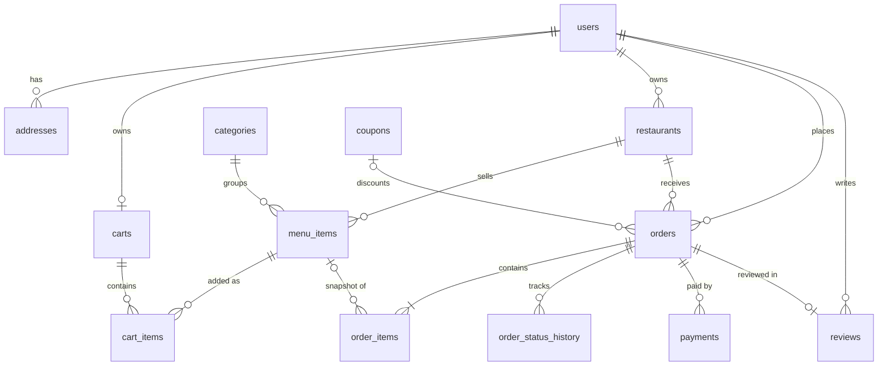

# FoodFlow: Online Food Ordering System

A full-stack food-ordering platform (in the spirit of Swiggy/Zomato) built to demonstrate **backend engineering**: real business rules, relational data modelling, security, transactions and concurrency, all backed by tests against a real PostgreSQL.

**Stack:** Java 21 · Spring Boot 3.5 · Spring Security + JWT · Spring Data JPA / Hibernate · PostgreSQL 17 · Flyway · React 19 · Docker Compose

```bash
cp .env.example .env        # then set passwords and a JWT secret (see "Environment variables")
docker compose up --build   # → http://localhost:3000   API docs: http://localhost:3000/swagger-ui.html
```

---

## Contents

- [Features](#features)
- [Architecture](#architecture)
- [Database schema](#database-schema)
- [Business rules worth reading](#business-rules-worth-reading)
- [API](#api)
- [Project structure](#project-structure)
- [Setup](#setup) · [Environment variables](#environment-variables) · [Running locally](#running-locally) · [Running with Docker](#running-with-docker)
- [Testing](#testing)
- [Sample credentials](#sample-credentials)
- [Screenshots](#screenshots)
- [Future improvements](#future-improvements)

---

## Features

| Customer | Restaurant owner | Admin |
|---|---|---|
| Browse and search restaurants (keyword, dish, category, rating, price, open now) | Create and edit restaurants, open or close for orders | Platform analytics: users, restaurants, orders, revenue, 7-day chart |
| Menus, cart (one restaurant at a time), coupons | Menu management: add, edit, sold-out toggle, delete | Enable or disable users (effective immediately) |
| Checkout with CARD / UPI / cash on delivery | Incoming orders; move them through the state machine | Activate or deactivate restaurants |
| Simulated payment gateway (success, decline, outage) | Dashboard: today's orders, pending, revenue, best sellers | All orders, coupon management, categories |
| Live order tracking, cancellation, automatic refunds | | |
| Reviews after delivery, personal dashboard | | |

## Architecture

```text
 Browser (React SPA)
    │  HTTP + JSON, relative URLs (/api/...), JWT in the Authorization header
    ▼
 Nginx (Docker) / Vite dev proxy ── serves the React build; forwards /api to the backend (same origin, no CORS)
    ▼
 Spring Boot
   Security filter chain ── JwtFilter: verify token → reload user → SecurityContext
   Controller   HTTP only: validate DTOs (@Valid), map status codes; thin
   Service      business rules + @Transactional boundaries
   Repository   Spring Data JPA (entities) · JdbcTemplate (analytics SQL)
   Hibernate + HikariCP connection pool + PostgreSQL JDBC driver
    ▼
 PostgreSQL 17 ── schema owned by Flyway migrations (V1…V10)
```

**How the backend talks to PostgreSQL.** At startup Spring Boot creates a **HikariCP** pool of JDBC connections, using `DB_URL`, `DB_USERNAME` and `DB_PASSWORD`. **Flyway** then applies any new `db/migration/V*.sql` files, and Hibernate *validates* that every entity matches the tables (`ddl-auto: validate`, so it never changes the schema). At runtime a service method calls a repository. Spring Data generates the query from the method name, a JPQL `@Query` or a `Specification`, and Hibernate translates it to SQL with **bind parameters**, which rules out SQL injection. The SQL runs on a pooled connection inside the service's `@Transaction`, and the rows are mapped back to entities, which are converted to DTOs before leaving the service. Dashboards use plain SQL through `NamedParameterJdbcTemplate`, because aggregation is SQL's job, not JPA's.

**Key decisions** (What · Why · Alternative):

| Decision | Why | Alternative considered |
|---|---|---|
| PostgreSQL | Orders, payments and coupons need ACID transactions, foreign keys, CHECK constraints, partial and expression indexes | MongoDB: no multi-document integrity for money flows |
| Flyway + `ddl-auto: validate` | Versioned, reviewable schema changes; identical in every environment | `ddl-auto: update`: silent, irreversible changes |
| DTOs only in the API | Password hashes can't leak; no lazy-loading JSON errors; stable contract | Returning entities |
| Stateless JWT | Any instance can verify any request; no session store; no CSRF | Server sessions |
| Reload the user on every request | Disabling an account takes effect immediately | Trusting the role claim until the token expires |
| Price snapshots in `order_items` | Orders are history; later menu changes must not rewrite them | Joining to the live price |
| Gateway interface + short transactions | A payment provider is swappable; network calls never run inside a DB transaction | Calling Razorpay inside `@Transactional` |

## Database schema



| Table | Purpose | Notable constraints and indexes |
|---|---|---|
| `users` | All accounts; `role` = CUSTOMER / RESTAURANT_OWNER / ADMIN | `UNIQUE(email)`, `CHECK(email = lower(email))`, role CHECK |
| `addresses` | Delivery addresses | Partial unique index: **one default per user** |
| `categories` | Global food categories (reference data, V3) | Unique on `lower(name)` |
| `restaurants` | Owned by one owner; cached `rating`/`rating_count`; `@Version` | Trigram GIN index on `lower(name)` for `%keyword%` search |
| `menu_items` | Dishes | `CHECK(price > 0)`; unique `(restaurant_id, lower(name))` |
| `carts`, `cart_items` | One cart per user, **no price column** | `UNIQUE(user_id)`; quantity 1–20 |
| `orders` | Price/address **snapshots**, status, payment state, coupon | `CHECK(total = subtotal − discount)`; `(user_id, created_at DESC)` |
| `order_items` | Snapshot of dish name and unit price | `CHECK(line_total = unit_price × quantity)` |
| `order_status_history` | Append-only audit trail and tracking timeline | |
| `payments` | Every payment attempt | Partial unique: **one active payment per order** (no double charge) |
| `coupons` | PERCENTAGE / FIXED_AMOUNT, limits, expiry | `CHECK(used_count <= usage_limit)` |
| `reviews` | One per delivered order | `UNIQUE(order_id)`, `CHECK(rating 1..5)` |

The full DDL, with the reason for every constraint and index, is in `backend/src/main/resources/db/migration/`.

## Business rules worth reading

Each rule is enforced on the server and covered by tests. Where concurrency matters, a test was also run *with the protection removed* to prove that it catches the bug.

| Rule | How | Where |
|---|---|---|
| Never trust client prices | Carts store only dish + quantity; orders copy the price at checkout | `CartServiceImpl`, `Order.addItem` |
| One restaurant per cart | `SELECT … FOR UPDATE` on the cart row → 409 `CART_RESTAURANT_MISMATCH` | `CartRepository.findByUserIdForUpdate` |
| Checkout is atomic | One `@Transactional` method: validate → snapshot → order → cash payment → coupon use → empty cart | `OrderServiceImpl.placeOrder` |
| Order state machine | Exhaustive `switch` of legal transitions; entity has no status setter | `OrderStatus`, `Order.changeStatus` |
| Can't cook unpaid online orders | CONFIRMED requires PAID (or cash on delivery) | `Order.changeStatus` |
| No double charge | Partial unique index + idempotency key; gateway called **outside** transactions | `PaymentServiceImpl`, V6 |
| Refund on cancel | `@TransactionalEventListener(AFTER_COMMIT)`, so refunds happen only if the cancel commits | `PaymentEventListener` |
| Coupon limits under load | One atomic `UPDATE … WHERE used_count < usage_limit` + DB CHECK | `CouponRepository.tryRedeem` |
| Exact ratings | SUM/COUNT recomputed under a restaurant row lock | `ReviewServiceImpl` |
| Ownership | `RestaurantAccess` (403) for public data; `OrderAccess` (404) for private data | `service/impl` |
| Brute-force protection | 5 failed logins per email+IP per 15 minutes → 429 | `LoginAttemptLimiter` |

## API

Interactive documentation: **`/swagger-ui.html`** (54 operations, all with request/response schemas and examples). Raw spec: `/v3/api-docs`, which can be imported into Postman.

| Area | Endpoints |
|---|---|
| Auth | `POST /api/auth/register`, `POST /api/auth/login` |
| Restaurants | `GET /api/restaurants?keyword&categoryId&minRating&open&minPrice&maxPrice&page&size&sort`, `GET /api/restaurants/{id}`, `GET /api/restaurants/{id}/menu`, `POST/PUT/DELETE /api/restaurants[/{id}]`, `PATCH …/open-status` |
| Menu | `POST /api/restaurants/{id}/menu-items`, `PUT/DELETE /api/menu-items/{id}`, `PATCH …/availability` |
| Cart | `GET/DELETE /api/cart`, `POST /api/cart/items`, `PUT/DELETE /api/cart/items/{id}` |
| Orders | `POST /api/orders`, `GET /api/orders`, `GET /api/orders/{id}`, `POST …/cancel`, `PUT …/status` |
| Payments | `POST /api/payments`, `GET /api/payments/{id}`, `GET /api/orders/{id}/payments` |
| Coupons | `GET /api/coupons`, `POST /api/coupons/validate`, admin CRUD under `/api/admin/coupons` |
| Reviews | `POST/GET /api/restaurants/{id}/reviews` |
| Dashboards | `GET /api/users/me/dashboard`, `GET /api/owner/dashboard`, `GET /api/admin/analytics` |
| Admin | `/api/admin/users`, `/api/admin/restaurants`, `/api/admin/orders`, `/api/admin/categories` |

Every error has one shape: `{"timestamp", "status", "error", "message", "path", "fieldErrors?"}`. The `error` field is a stable code the UI can switch on, such as `COUPON_EXPIRED`, `INVALID_STATUS_TRANSITION` or `TOO_MANY_ATTEMPTS`.

## Project structure

```text
FoodFlow/
├── backend/                  Spring Boot (Maven Wrapper; no Maven install needed)
│   ├── src/main/java/com/foodflow/
│   │   ├── config/           security, OpenAPI, properties, clock, demo-data seeder
│   │   ├── controller/       REST endpoints (thin)
│   │   ├── dto/              request/response records, per feature
│   │   ├── entity/           JPA entities + enums (state machine in OrderStatus)
│   │   ├── exception/        ApiException hierarchy + GlobalExceptionHandler
│   │   ├── repository/       Spring Data repositories, Specifications, analytics SQL
│   │   ├── security/         JwtUtil, JwtFilter, UserPrincipal, login limiter
│   │   ├── service/          interfaces · impl/ business logic · payment/ gateway boundary
│   │   └── util/             money arithmetic, safe paging
│   ├── src/main/resources/   application.yml, db/migration (Flyway V1–V10)
│   ├── src/test/java/        334 tests (unit, slice, integration, concurrency)
│   └── Dockerfile
├── frontend/                 React 19 + Vite
│   ├── src/  services/ (Axios) · context/ (auth, cart) · routes/ · pages/ (+owner/, admin/) · components/
│   ├── nginx.conf, security-headers.conf
│   └── Dockerfile
├── database/README.md        psql tips
├── docker-compose.yml        postgres + backend + frontend, started in health-checked order
└── .env.example              every configuration value, documented
```

## Setup

**Requirements:** Docker Desktop, which is all you need for `docker compose up`. For local development you also need **JDK 21+** and **Node.js 20.19+** (or 22.12+).

### Environment variables

```bash
cp .env.example .env
```

| Variable | Used by | Notes |
|---|---|---|
| `POSTGRES_DB`, `POSTGRES_USER`, `POSTGRES_PASSWORD` | postgres container | Required. Compose refuses to start without them |
| `DB_URL`, `DB_USERNAME`, `DB_PASSWORD` | backend (local runs) | Compose sets `DB_URL` to the `postgres` service automatically |
| `JWT_SECRET` | backend | Required, ≥ 32 bytes, Base64. Generate with `openssl rand -base64 48` |
| `JWT_EXPIRATION_MS` | backend | Default 24 h |
| `CORS_ALLOWED_ORIGINS` | backend | Only for direct browser→API calls; the UI uses same-origin proxies |
| `APP_TIMEZONE` | backend | Business day for "today" and the charts (default `Asia/Kolkata`) |
| `SEED_DEMO_DATA` | backend | `true` fills an empty database with demo data. **Development only** |
| `PAYMENT_FAILURE_RATE` | backend | 0.0–1.0; random simulated payment failures for demos |
| `SWAGGER_ENABLED` | backend | Set `false` in production |
| `FRONTEND_PORT`, `BACKEND_PORT`, `POSTGRES_PORT` | compose | Host ports (defaults 3000 / 8080 / 5432) |

No secret has a default value anywhere in the code; missing ones stop the application at startup.

### Running locally

```bash
docker compose up -d postgres          # just the database
cd backend && ./mvnw spring-boot:run   # API on :8080 (reads ../.env)   Windows: mvnw.cmd
cd frontend && npm install && npm run dev   # UI on :5173 (proxies /api to :8080)
```

> **Windows note:** if Tomcat fails with `Unable to establish loopback connection`, some security software is blocking Unix-domain sockets under `AppData\Local`. Run with `./mvnw spring-boot:run "-Dspring-boot.run.jvmArguments=-Djdk.net.unixdomain.tmpdir=C:\Users\Public\java-uds"`.

### Running with Docker

```bash
docker compose up --build        # first run builds both images
```

| URL | What |
|---|---|
| http://localhost:3000 | The app (Nginx serving React, proxying `/api`) |
| http://localhost:3000/swagger-ui.html | API documentation |
| http://localhost:8080/actuator/health | Backend health |

Start-up order is enforced by health checks: PostgreSQL → backend (UP only once its database check passes) → frontend. Data lives in the `foodflow-pgdata` volume. `docker compose down -v` deletes it.

## Testing

```bash
cd backend && ./mvnw verify      # needs Docker running (Testcontainers)
```

**334 tests, 94.9% line coverage and 80.7% branch coverage** (JaCoCo report: `backend/target/site/jacoco/index.html`).

| Kind | Examples | Why |
|---|---|---|
| Unit (JUnit 5 + Mockito) | `OrderServiceImplTest`, `CouponServiceImplTest`, `CartServiceImplTest`, `JwtFilterTest`, `CouponTest`, `OrderStatusTest` | Business rules in milliseconds, each scenario isolated |
| Web slice (`@WebMvcTest`) | `OrderControllerSecurityTest` | Security and validation rules without a database |
| Repository (`@DataJpaTest`) | constraint, index and N+1 tests with SQL statement counts | Proves the **database** enforces the rules |
| Integration (MockMvc + Testcontainers PostgreSQL) | every API, role and ownership rule | Real HTTP → security → service → PostgreSQL |
| Concurrency and atomicity | cart race, coupon race (8 threads), review race, rollback via DB trigger, refund after commit | Correctness under real concurrent transactions |

Tests are hermetic: every setting they depend on is pinned in `application-test.yml`, so a developer's `.env` can't change results.

## Sample credentials

> ⚠️ **Development only.** Created by the demo seeder (`SEED_DEMO_DATA=true`). The people are fictional.

| Role | Email | Password |
|---|---|---|
| Admin | `admin@demo.foodflow.dev` | `Demo@1234` |
| Owner (Biryani House, Pizza Planet, Burger Barn) | `owner1@demo.foodflow.dev` | `Demo@1234` |
| Owner (Dosa Darbar, Wok Express) | `owner2@demo.foodflow.dev` | `Demo@1234` |
| Customers | `customer1@demo.foodflow.dev` … `customer5@demo.foodflow.dev` | `Demo@1234` |

Coupons: `WELCOME50` (50% up to ₹100, min ₹199), `FLAT100` (₹100 off ₹499+), `SAVE10` (10% up to ₹75). Payment tokens for the simulator: `tok_visa` (succeeds), `tok_chargeDeclined`, `tok_insufficientFunds`, `tok_timeout`.

## Screenshots

_Add screenshots here: home, restaurant menu, cart with coupon, checkout, order tracking, owner dashboard, admin dashboard, Swagger UI._

## Future improvements

- **Refresh tokens and logout-everywhere** (short-lived access tokens), or httpOnly-cookie sessions for the web client
- **Payment webhooks and reconciliation**: a scheduled job that retries failed refunds and settles PENDING payments with the gateway
- **Real-time order tracking** over WebSockets/SSE instead of 15-second polling
- **Distributed rate limiting** (Redis) once there is more than one backend instance
- **Caching** for public restaurant and menu reads, with a short-TTL cache for the per-request user lookup
- **Outbox pattern** for events, so a refund request survives a crash between commit and processing
- Restaurant approval workflow before a new restaurant goes live; delivery partners; ETA estimation
- CI pipeline (GitHub Actions) running `./mvnw verify` and the frontend build on every push
